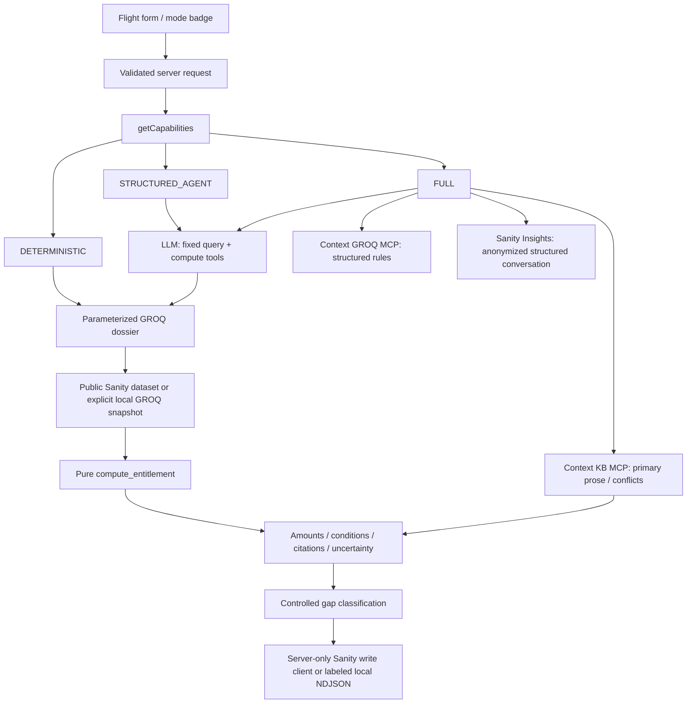

# Disruption Desk

Flight disruption rights with a paper trail: structured facts select rules, code calculates amounts, and every ruling makes conditions, citations and uncertainty visible. No login. Information, not legal advice.

**Actual shipped state:** DETERMINISTIC mode, explicitly labeled **LOCAL_SNAPSHOT** content backend. Live Sanity tools were not exposed to this cloud session, even after the user reported the plugin installed. Nothing was created, deployed, imported, published or built in Sanity. The app is runnable; the challenge's real-content requirement remains outstanding until the authenticated import steps in [HANDOFF.md](HANDOFF.md) are completed. No Context results or model runs were fabricated.

## Run

Node 24.19.0 and pnpm 11.19.0 were used. Versions are pinned in `.nvmrc`, `package.json` and `pnpm-lock.yaml`. Use the existing checkout: cloud tasks are already isolated; do not create a worktree.

```sh
pnpm install --frozen-lockfile
pnpm dev
# Production, in separate steps:
pnpm build
pnpm start
```

The app listens on port 3000. Copy `env.example` to `.env.local` only when configuring external services; all `.env*` files are ignored. No keys are needed for the local deterministic workflow. The local package cache lives under `.local/`; the cloud workspace's pnpm store setting can be overridden with `pnpm install --store-dir .local/pnpm-store` on another machine. Only esbuild's dependency build is approved; artifact verification is kept enabled.

```sh
pnpm test       # 54 meaningful unit/boundary/guard tests
pnpm typecheck
pnpm eval       # frozen 40-case dev/test suite; unavailable modes explicitly not run
pnpm smoke      # after starting the app; sourced API + gap behavior
```

Optional browser smoke uses Playwright and installed Chromium. In this cloud machine:

```sh
PLAYWRIGHT_MODULE=/opt/codex/cua_node/lib/node_modules/playwright-core CHROMIUM_PATH=/usr/bin/chromium node scripts/browser-smoke.cjs
```

A normal machine can install `playwright-core` separately and set `CHROMIUM_PATH`; it is not required by the application. Desktop (1440px) and mobile (390px) were exercised with no horizontal overflow or browser exceptions. Local evidence screenshots are in `docs/screenshots/`.

## Architecture



`src/lib/content.ts` runs one structured GROQ dossier: rule trigger, cause reference, airline-policy filter, regimes, bands and primary source metadata. It uses `@sanity/client` in SANITY_LIVE mode and `groq-js` over the identical prepared document model in LOCAL_SNAPSHOT. Setting a project ID never silently falls back to local content.

`src/lib/compute.ts` is a pure function over that dossier. Distance-band values, rerouting reductions, notice windows, fare multipliers and caps come from referenced content; the model does no monetary arithmetic. Route/carrier scope uses structured applicability alternatives. Arrival delay and departure-delay care are distinct. Passengers who decline travel do not receive a determined EU/UK arrival-delay award; refund/care remain separate. US delay-based refunds use the carrier’s changed scheduled arrival, not a post-travel observed delay. Overlapping regimes produce separate findings with a warning against double recovery. Missing rules, versions, provenance or material conditions cause abstention.

In AI modes the model is forced to call retrieval and computation tools before returning a constrained, number-free observation. It cannot replace the computed ruling, citations or amounts; observations inconsistent with the computed status are rejected. Retrieved content is treated as evidence, not instructions. FULL discovers real tools from both Context endpoints and reads their initial context. Every required endpoint/tool must complete or the request fails. The real adapter has HTTPS/authentication/cleanup/error tests; live endpoint integration remains unrun.

## Runtime modes

One `getCapabilities()` owns mode selection; no client secret inspection.

| Mode | Bindings | Behavior | Validated here |
|---|---|---|---|
| DETERMINISTIC | No LLM key | Form → GROQ → compute → cited template. Search is keyword discovery plus **precomputed** examples. | Yes, LOCAL_SNAPSHOT only |
| STRUCTURED_AGENT | One LLM key; incomplete/no Context bindings | LLM → fixed GROQ read via public `@sanity/client` → compute. Requires live project ID. | No credentials; not run |
| FULL | One LLM key + both MCP URLs + organization token | Forced KB read + Context GROQ query + public dossier + compute. Real Insights integration when organization ID is set. | No bindings; not run |

The evaluation CLI loads an ignored `.env.local` when present; secure process variables can also supply bindings. Next.js loads `.env.local` for its server.

Provider priority: `GOOGLE_GENERATIVE_AI_API_KEY`, then `ANTHROPIC_API_KEY`, then `OPENAI_API_KEY`. Default models: Gemini 2.5 Flash, Claude Sonnet 4.6, GPT-4.1 mini. `LLM_MODEL` overrides the chosen provider's model. `ai@6` and `@ai-sdk/mcp@^1` are intentionally compatible.

Content backend is a separate badge: `SANITY_PROJECT_ID` selects **SANITY_LIVE**, otherwise **LOCAL_SNAPSHOT**. Agent modes reject the local backend rather than simulate a live agent. Read failures are errors.

Server-only variables:

- `SANITY_PROJECT_ID`, `SANITY_DATASET` (default `production`): public structured data.
- `SANITY_KB_MCP_URL`, `SANITY_DATA_MCP_URL`, `SANITY_ORGANIZATION_TOKEN`: real Context read-only endpoints.
- `SANITY_ORGANIZATION_ID`, `SANITY_CONTEXT_ENDPOINT_NAMES`: Insights client and endpoint metadata. FULL can run without Insights, but the UI/API capability flag and handoff should not claim telemetry in that case.
- `SANITY_WRITE_TOKEN`: separate project write scope for gap documents; a Context Viewer token is not a substitute.
- `GAP_STORAGE_DIR`: optional local diagnostic path; use `/tmp/disruption-desk-gaps` on Vercel when no durable write binding is present. Local gaps do not survive serverless instances.

No free-text searches, names, booking references, IPs or airport identifiers enter the model/Insights. Inputs are broad jurisdictions and numerical disruption facts. Gaps contain controlled categories and explanations only. Hosted Insights classification still needs the separate scheduled function described in the fetched official Insights docs; telemetry wiring alone does not classify conversations.

## Evidence and limits

Prepared, not uploaded: **57 public documents + 36 private article/section chunks + 40 golden scenario documents = 133**. `schema/types.json` contains twelve plain literal document declarations; no local Studio or `sanity.config.*` exists. `data/import/` contains complete sub-100-kB MCP create/publish payloads with stable array keys. Public content has structured references, own-words summaries and no long copied airline prose. Private corpus includes covered legal provisions and own-words official/airline summaries; baggage sections are excluded.

Primary material fetched and reviewed in this run includes original EU261 from the official National Archives mirror, current consolidated UK261 XML, 14 CFR Parts 250/260, DOT guidance, European Commission guidance, CJEU Sturgeon/Nelson official announcements, and IndiGo/Delta contractual excerpts. Fetch URLs, status, timestamps and hashes are in `data/retrieval.json`; verification anchors are in `data/verification.json`. A successful HTTP response is not enough: empty EUR-Lex responses and browser challenges were not treated as evidence. Official court announcements are labeled **summaries, not full judgments**.

India's current CAR revision could not be verified; Indian statutory findings abstain. The requested full court/airline breadth was not achieved. No airline terms stand in for Indian law, and no AirSewa/consumer-forum remedy was invented. Connecting journeys, Switzerland, baggage, non-time schedule changes and universal deadlines are outside this engine. Historical/future versions outside verified dates are not adjudicated. The revised US oversales caps apply from January 22, 2025, verified against the Federal Register final rule; India has no invented effective date. Corpus dates describe supported rule versions, and are not a universal enactment date for a jurisdiction. Public/rewards fares and fixed-wing scheduled passenger aircraft are the supported assumptions; excluded concessions/aircraft require review.

The genuine US table/regulation boundary tension appears side by side at exactly two hours domestic / four hours international. `CONFLICT_WATCHLIST.md` separates that observed wording issue from anticipated Issues questions. Nothing was resolved in an unseen Sanity Issues queue.

## Evaluation and readiness

See [EVAL_RESULTS.md](EVAL_RESULTS.md) for current metrics, raw output locations and limits. Forty curated cases are frozen 70/30, with twelve expected partial/total abstentions. Headline scores use 32 `primary_text` cases; eight policy/coverage cases are `agent_inferred`. The local deterministic run matched all expected cases. B1 keyword retrieval missed structured cases. B0 is implemented as a clearly labeled no-retrieval symbolic LLM baseline with shared code arithmetic; it was not run. Credentialed agent modes remain unrun.

Citation metadata validity checks fetched URL/hash identity, not an independent legal-entailment audit. A perfect result on this small suite is not a general legal-accuracy claim or proof of Sanity/Context integration. Raw outputs, fixture/content hashes and split metrics are saved in `eval/runs/`.

Guards: fifteen requests per IP per minute per process, bounded rate-limit memory, streamed 12-kB request cap, validated facts, five agent steps and 1,200 output tokens per step, no automatic LLM retries, timeout and generic error responses. Behind Vercel, trust only its managed forwarded-IP boundary. The in-memory limiter is not a distributed production quota; scale-out would require shared state.

Repository phases are committed locally. No push, PR, Vercel deployment, published environment snapshot or public demo was created. Follow [HANDOFF.md](HANDOFF.md), [KB_SETUP.md](KB_SETUP.md), [STATUS.md](STATUS.md) and [SUBMISSION.md](SUBMISSION.md) for the exact outstanding operations.
